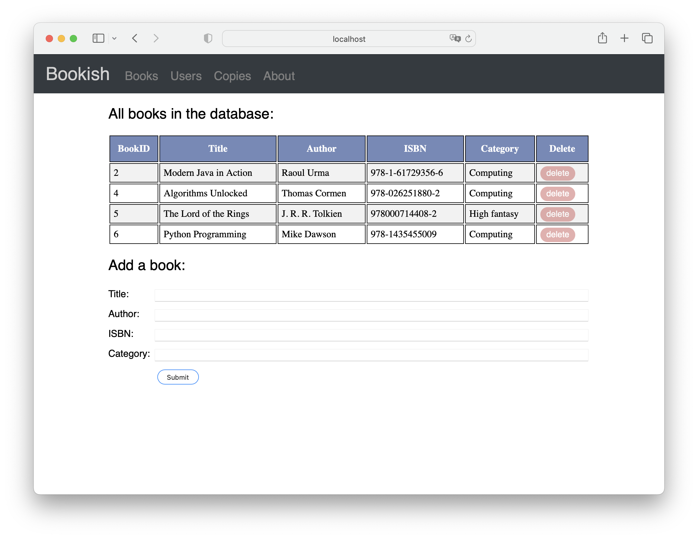
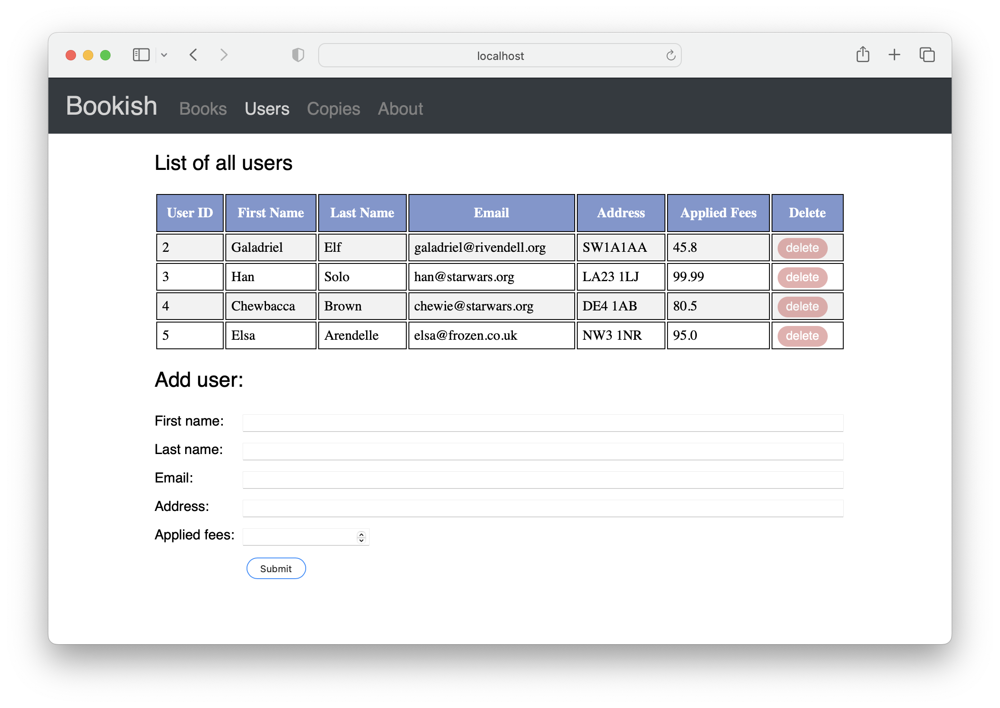
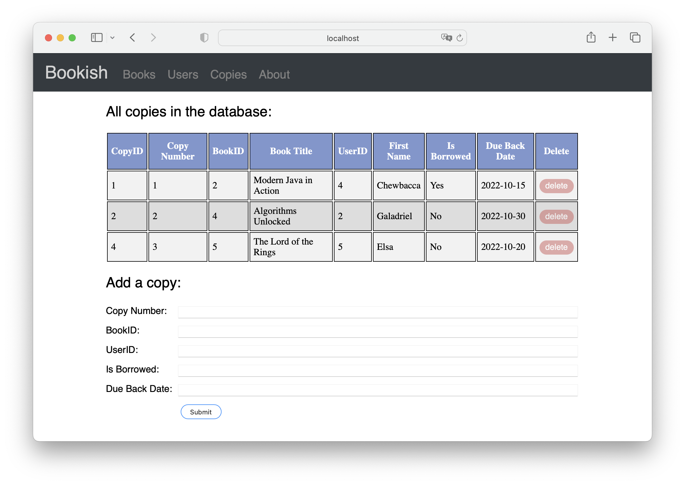
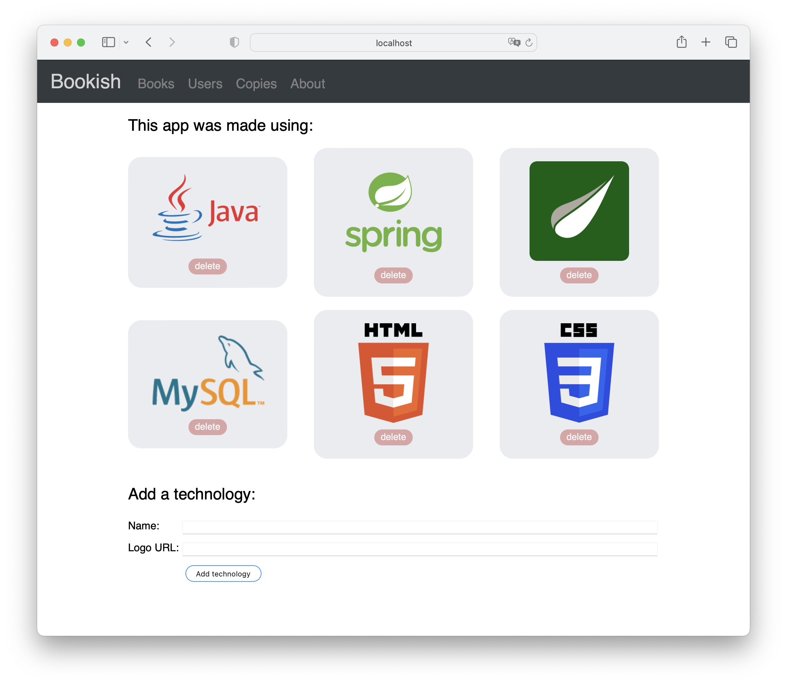

# Bookish

Simple library management system. 
The librarian can add books, delete books, add and delete users of the library, assign books to users with due date. 

The full requirements can be found at https://corndel.atlassian.net/wiki/spaces/AC/pages/23036093/6+-+Book+ish

Landing page: 

Books page:

Users page:

Copies page:

About page:

